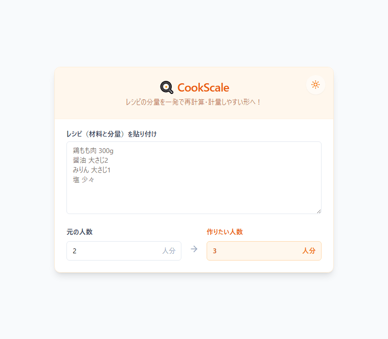

# 料理分量らくらく計算（CookScale）

レシピの人数・分量を、料理中に使いやすい形へ変換する無料・登録不要のブラウザ完結Webツールです。

🔗 **公開URL（ブラウザで今すぐ利用可能）**: [https://tk030-lotto.github.io/recipe-quantity-calculator/](https://tk030-lotto.github.io/recipe-quantity-calculator/)



## コンセプト

「レシピの計算をする」のではなく、**料理中に発生する面倒な計算・換算を、その場で簡単に片付ける**ことを目的とします。

主な対象は、レシピの人数変更、分量倍率変更、計量単位の変換、計量しやすい表示への整形です。

## 主な特徴

- **無料・登録不要**: ログイン不要で誰でもすぐに使えます。
- **ブラウザ完結 (完全ローカル動作)**: 入力データは外部送信されず、完全にブラウザ内で計算処理されます。
- **レシピ一括貼り付け**: 複数行の材料テキストをまとめてペースト可能。
- **人数倍率自動計算**: 元の人数と作りたい人数から瞬時に分量を再計算。
- **単位認識 & 計量形式への自動整形**: g / ml / 大さじ / 小さじ / カップ / 助数詞（個、本、枚等）を自動認識し、大さじ・小さじの組み合わせ（`大さじ1＋小さじ1.5` 等）へ最適化。
- **非数値表現の保持**: 「少々」「適量」「お好みで」等の表現は無理に数値化せずそのまま保持。
- **結果の一括コピー**: 計算後の材料一覧をワンクリックでクリップボードにコピー。
- **お気に入り / プリセット保存**: よく作るレシピをローカル（`localStorage`）に保存・ワンクリック呼び出し可能。
- **ダークモード対応**: 調理環境の明るさに応じてライト/ダークテーマを切り替え可能。
- **スマホ最適化UI**: モバイル端末での片手操作を想定した大型タップターゲット設計。

## 使い方

1. レシピの材料を複数行まとめて貼り付けます。
2. 「元の人数」と「作りたい人数」を入力します。
3. 自動計算された分量結果を確認します。
4. 必要に応じて「結果をコピー」ボタンでメモ帳やメッセージアプリ等へ貼り付けます。

入力例：

```text
鶏もも肉 300g
醤油 大さじ2
みりん 大さじ1
砂糖 小さじ2
酒 大さじ1
塩 少々
```

## 技術構成

- **Frontend**: React 19, TypeScript, Tailwind CSS (v3), shadcn/ui, Lucide Icons
- **Build Tool**: Vite 6
- **Test**: Vitest (18 tests)
- **Deployment**: クライアントサイドSPA（サーバーサイド不要）

## プライバシー

基本的な計算処理・お気に入り保存はすべてブラウザ上（`localStorage`）で行い、レシピ入力内容を外部サーバーへ送信しません。

## ライセンス

本プロジェクトは **MIT License** のもとで公開されています。

```text
MIT License

Copyright (c) 2026 tk030

Permission is hereby granted, free of charge, to any person obtaining a copy
of this software and associated documentation files (the "Software"), to deal
in the Software without restriction, including without limitation the rights
to use, copy, modify, merge, publish, distribute, sublicense, and/or sell
copies of the Software, and to permit persons to whom the Software is
furnished to do so, subject to the following conditions:

The above copyright notice and this permission notice shall be included in all
copies or substantial portions of the Software.

THE SOFTWARE IS PROVIDED "AS IS", WITHOUT WARRANTY OF ANY KIND, EXPRESS OR
IMPLIED, INCLUDING BUT NOT LIMITED TO THE WARRANTIES OF MERCHANTABILITY,
FITNESS FOR A PARTICULAR PURPOSE AND NONINFRINGEMENT. IN NO EVENT SHALL THE
AUTHORS OR COPYRIGHT HOLDERS BE LIABLE FOR ANY CLAIM, DAMAGES OR OTHER
LIABILITY, WHETHER IN AN ACTION OF CONTRACT, TORT OR OTHERWISE, ARISING FROM,
OUT OF OR IN CONNECTION WITH THE SOFTWARE OR THE USE OR OTHER DEALINGS IN THE
SOFTWARE.
```
